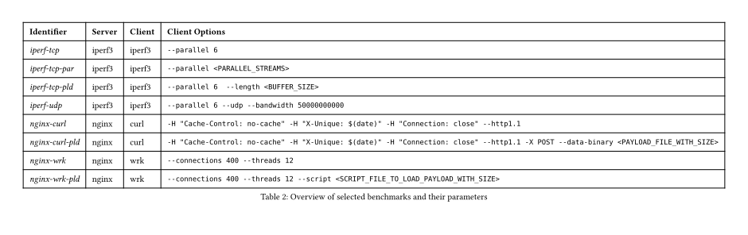
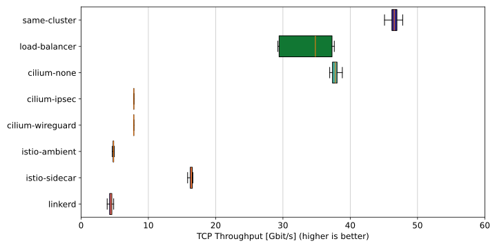
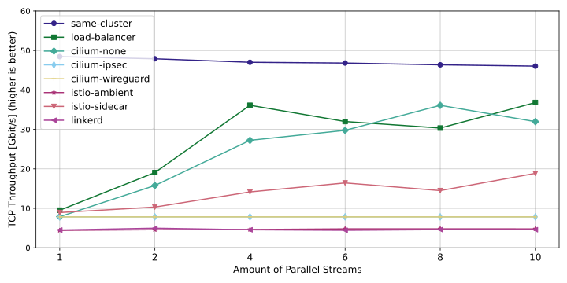
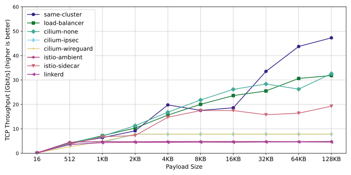
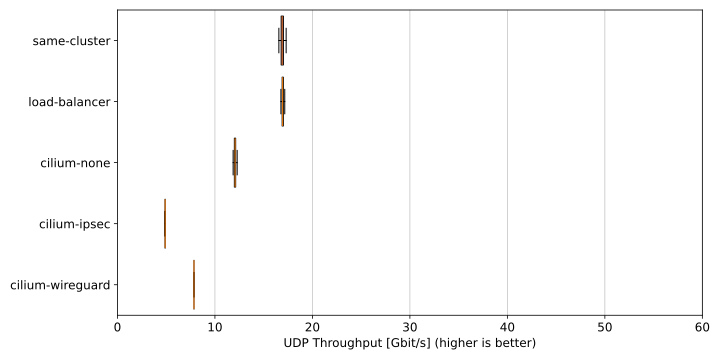
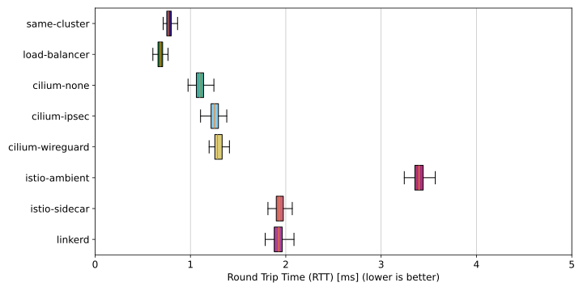
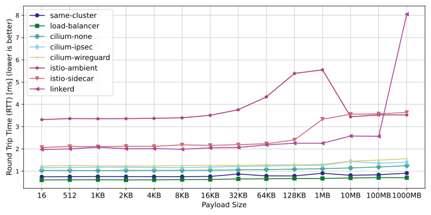
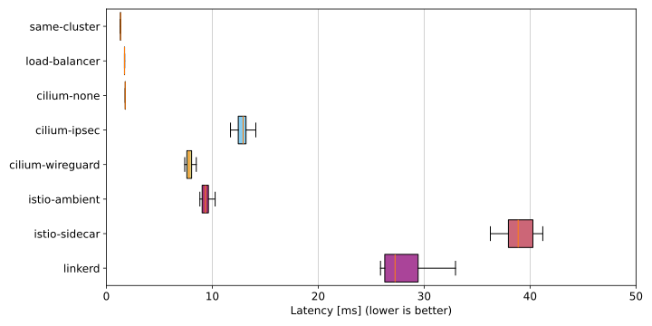
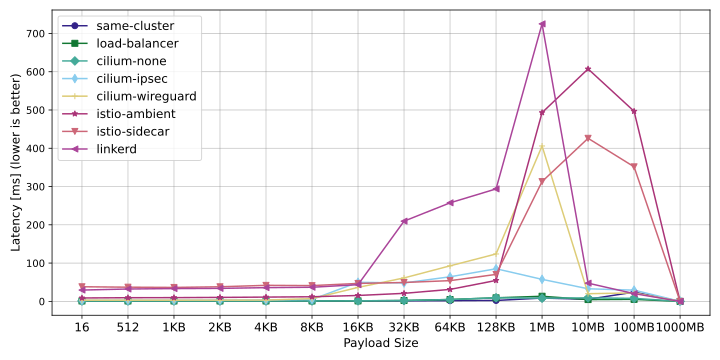
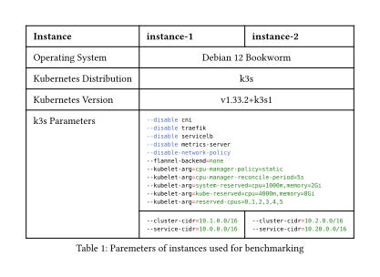

# Kubernetes Multi Cluster Benchmarking Setup

## Try it out

This requires docker to be installed on your system!

1. Edit `config.cfg` file to your liking
2. Enter `./benchmarks.sh help` to get an overview of commands available
3. Enter `./benchmarks.sh clusters-create` to create two k8s clusters with the configured provider
4. Enter `./docker.sh bash benchmarks.sh benchmarks` to run the benchmarks using a dedicated docker container, this creates a new directory in the `results` folder
5. Enter `./benchmarks.sh plot <newly created folder>` to generate plots into `plotting/results`

## Results

The benchmark results are presented in the order of the table.

Instance-1 and Instance-2 are two ec2 instances running in the same placement group, subnet, VPC and region on AWS.
